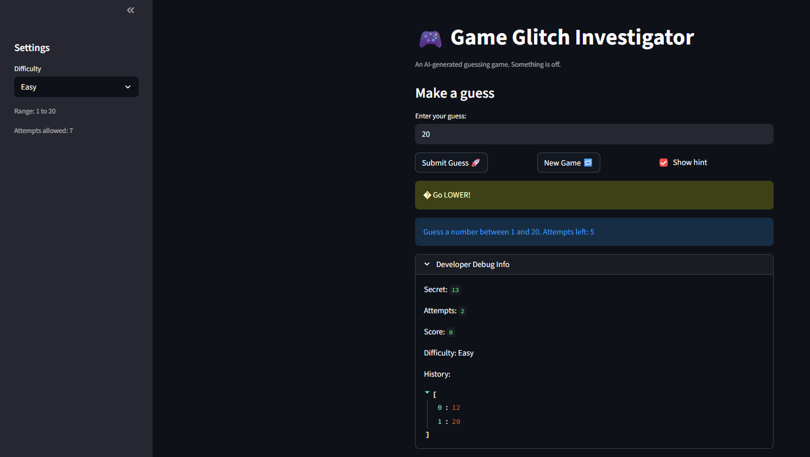

# 🎮 Game Glitch Investigator: The Impossible Guesser

## 🚨 The Situation

You asked an AI to build a simple "Number Guessing Game" using Streamlit.
It wrote the code, ran away, and now the game is unplayable. 

- You can't win.
- The hints lie to you.
- The secret number seems to have commitment issues.

## 🛠️ Setup

1. Install dependencies: `pip install -r requirements.txt`
2. Run the broken app: `python -m streamlit run app.py`

## 🕵️‍♂️ Your Mission

1. **Play the game.** Open the "Developer Debug Info" tab in the app to see the secret number. Try to win.
2. **Find the State Bug.** Why does the secret number change every time you click "Submit"? Ask ChatGPT: *"How do I keep a variable from resetting in Streamlit when I click a button?"*
3. **Fix the Logic.** The hints ("Higher/Lower") are wrong. Fix them.
4. **Refactor & Test.** - Move the logic into `logic_utils.py`.
   - Run `pytest` in your terminal.
   - Keep fixing until all tests pass!

## 📝 Document Your Experience

- [ ] Describe the game's purpose.
The game purpose is to produce a guessing game where the user will have to guess the secret number using higher and lower hints. The difficulty is selectable and will have a varying number of guesses and range of numbers.
- [ ] Detail which bugs you found.
There were lots of bugs including the higher and lower hints logic, the reset game logic not working properly, the ranges and attempt number being inaccurate, and the enter to apply functionality not working properly, the values not being updated for each difficulty.
- [ ] Explain what fixes you applied.
I applied fixes to fix the higher and lower logic and tested it with a test, I also adjusted the values for each difficulty, and finally fixed the logic with the reset game to properly reset your score and the history.

## 📸 Demo

- [ ] []

## 🚀 Stretch Features

- [ ] [If you choose to complete Challenge 4, insert a screenshot of your Enhanced Game UI here]
